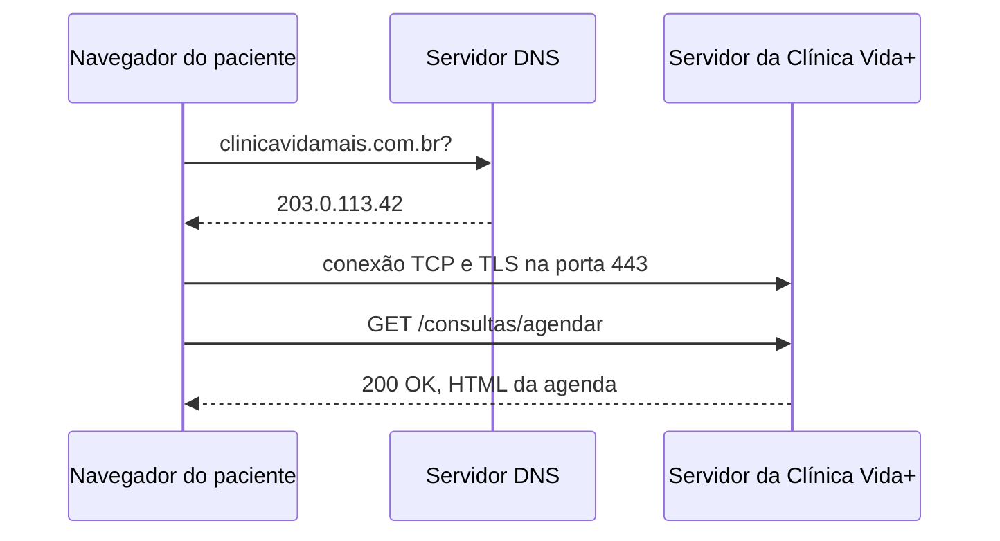

## O caminho de uma requisição

O formulário de agendamento da Clínica Vida+ necessita obrigatoriamente do protocolo HTTPS para garantir a criptografia dos dados em trânsito entre o navegador do usuário e o servidor, impedindo que terceiros interceptem a comunicação. Essa proteção é indispensável porque o sistema manipula informações pessoais e médicas altamente confidenciais, como o CPF do paciente e os sintomas ou especialidade médica selecionada. Sem o HTTPS, esses dados sensíveis ficariam expostos a ataques de interceptação, violando a privacidade do usuário e as diretrizes da LGPD.
