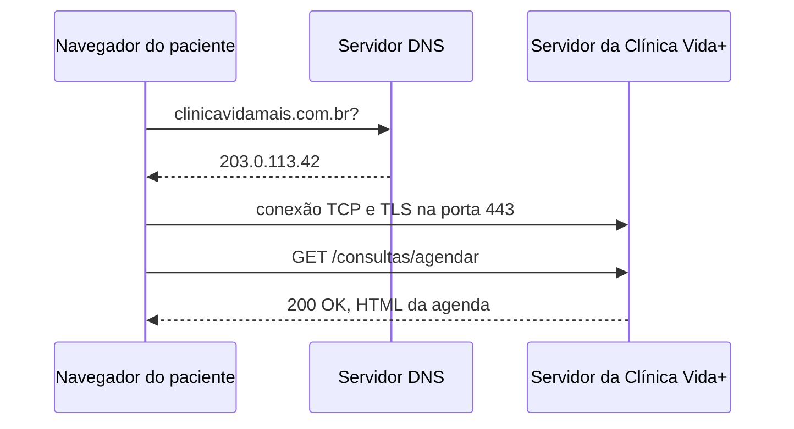

# Arquitetura da Clínica Vida+

## O caminho de uma requisição



## Evidência do DNS

```text
Servidor:  ns3.uninove.br
Address:  186.251.39.123
```

## Evidência do HTTP

| Método | Recurso | Status |
| :--- | :--- | :--- |
| GET | / | 200 |
| GET | /css/estilo.css | 200 |
| GET | /js/app.js | 200 |
| GET | /pagina-que-nao-existe | 404 |

## Por que o formulário de agendamento precisa de HTTPS

O formulário de agendamento da Clínica Vida+ necessita obrigatoriamente do protocolo HTTPS para garantir a criptografia dos dados em trânsito entre o navegador do usuário e o servidor, impedindo que terceiros interceptem a comunicação. Essa proteção é indispensável porque o sistema manipula informações pessoais e médicas altamente confidenciais, como o CPF do paciente e os sintomas ou especialidade médica selecionada. Sem o HTTPS, esses dados sensíveis ficariam expostos a ataques de interceptação, violando a privacidade do usuário e as diretrizes da LGPD.
